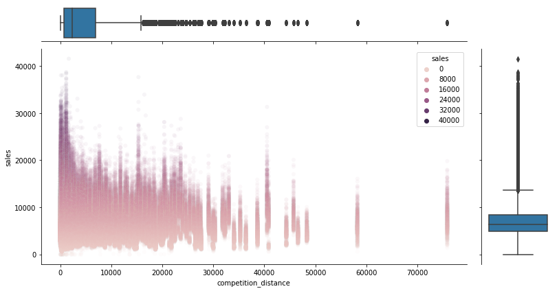

# **BUSINESS UNDERSTANDING**

## What is the company?

Rossmann.

## What is its business model?

Rossmann operates over 3,000 drug stores in 7 European countries. Its products range includes up to 21,700 items and can vary depending on the size of the shop and the location. In addition to drugstore goods with a focus on skin, hair, body, baby and health, Rossmann also offers promotional items ("World of Ideas"), pet food, a photo service and a wide range of natural foods and wines. 

## What is the business problem the company is facing?

Rossmann store managers need daily sales predictions for up to six weeks in advance so as to plan infrastructure investments in their stores (will next six weeks sales be high enough to balance infrastructure investment?).

## What is the business solution that this project has to deliver?

For each store, the daily sales predictions for the next six weeks.

REFERENCES:

https://www.kaggle.com/c/rossmann-store-sales
https://en.wikipedia.org/wiki/Rossmann_(company)

# **BUSINESS ASSUMPTIONS**

## Hypothesis

In order to make predictions for the next six weeks, Rossmann company has to provide data about its stores for this time interval. Such data, for each store, must include: store model, store assortment level and if the given store will be on continuous promotion.

References:

https://www.kaggle.com/c/rossmann-store-sales

# **SOLUTION STRATEGY**

## Step 01. Data Extraction:
For the available data, check files and data fields description. Then load data from CSV files and merge different tables.

## Step 02. Data Description:
Rename columns and check the number of rows in the table (does it requires big data tools?). Convert data types for some columns and fill out NA (not-available) values. Then use statistics metrics to identify data outside the scope of business.

## Step 03. Feature Engineering:
Create a hypothesis list to check on the fifth step (EDA). Then apply data transformations on the required columns.

## Step 04. Data Filtering:
Filter rows and select columns that do not contain information for modelling or do not match the scope of the business, such as predict sales for a closed store.

## Step 05. Exploratory Data Analysis:
Analyse each variable alone and then the relationship among variables. Then, explore the data further to validate the hypothesis list and raise insights.

## Step 06. Data Preparation:
Split data into train and validation and test. Then, prepare data so that the Machine Learning models can more easily learn and perform more accurately.

## Step 07. Feature Selection:
Select the most significant attributes for training the model.

## Step 08. Machine Learning Modelling:
Test different Machine Learning models and select the one with the best performance in prediction sales according to the selected attributes.

## Step 09. Hyperparameter Fine Tuning:
Choose the best values for each parameter of the selected ML model.

## Step 10. Performance Evaluation and Interpretation:
Compare the training and the learning performance (overfitting vs underfitting). Then test the ML model on data equivalent to production data (generalization performance) and convert the ML performance into business results.

## Step 11. Deployment:
Create APIs (Application Programming Interface) to make predictions available on internet requests. Then, for the final user, create a Telegram bot where the user types the number of store and the bot answer with the sales prediction for this given store in the next six weeks. Finally, create a data app where the user could check the sales prediction over these six weeks and also read the entire project overview.

# **TOP 3 INSIGHTS**

## H1. Different store assortments contribute differently to sales revenue.

> H1 IS TRUE. Different store assortments contribute differently to sales revenue and **'extra' assortment has higher median sales**.
    

    

## H2. The nearer to competitors, the lower the sales revenue.

> H2 IS FALSE. The nearer to competitors, the higher the sales revenue tends to be.

 

## H3. The sales revenue is higher on weekends.

> H3 IS FALSE. From Monday till Thursday, the sales revenue is higher than from Friday till Sunday.

 

# **BUSINESS RESULTS**

**You can check the Telegram bot at the following link**

https://www.youtube.com/watch?v=6yQgYIjbQog

**You can check the data App at the following link**

https://rossmann-sales-streamlit.herokuapp.com/

# **DEPLOYMENT**

**Telegram Bot**

To make predictions more straightforward for the final user, a Telegram bot was created so the user just needs to type the number of the store and the bot will quickly answer the sales prediction for this given store in the next six weeks. 

You can check how easy is to get predictions via this Telegram bot by watching the following video:

https://www.youtube.com/watch?v=6yQgYIjbQog

**Streamlit**

If the final user wants more detailed information about this six weeks prediction, he (she) could get further details on a data App. This data App has information, with an interactive chart, on sales prediction over these six weeks. Besides, the user can also read the entire project overview to understand further how this prediction is made.

You can check this data App at the following link:

https://rossmann-sales-streamlit.herokuapp.com/

# **CONCLUSIONS**

It took me a while to go from the very beginning till the very end of the project (actually, it took me about two weeks). 

Even within just two weeks, we can easily see that **Data Science projects can deploy straightforward solutions to support business team decisions, making these decisions not only more precise but also easier to be made.**

# - LESSONS LEARNED

**How to do an end-to-end Data Science project.**

How to build a Flask API, data App, Telegram bot and host all of them on Heroku cloud so that the solution is available online.

**It's important to focus on the business solution** and don't get lost in 'playing' with different tools.

**The most important thing is the business solution so**, if one tool is not working or if it is taking too much time to implement, find another one that will **keep the project pacing forward.**

**On the first project cycle, it's important to keep things simple** and not try to get the best solution because this can only be achieved through many project cycles.

# **NEXT STEPS TO IMPROVE**

**Streamlit**: make App run faster and create more options for the user to further analyse prediction data.

**Telegram Bot**: create more options for the user so, for example, the user could get a chart with sales predictions besides the single value prediction.

**Features**: try different variables, scalers and encodings so that ML performance improves.

**API**: implement data validation on API requests to make it less error-prone and more easily debugged in case of error.

**Machine Learning Models**: test more ML models to find one with better results. 

**Code**: review the whole code once more to make it clearer and more efficient (faster and less resource-intensive).